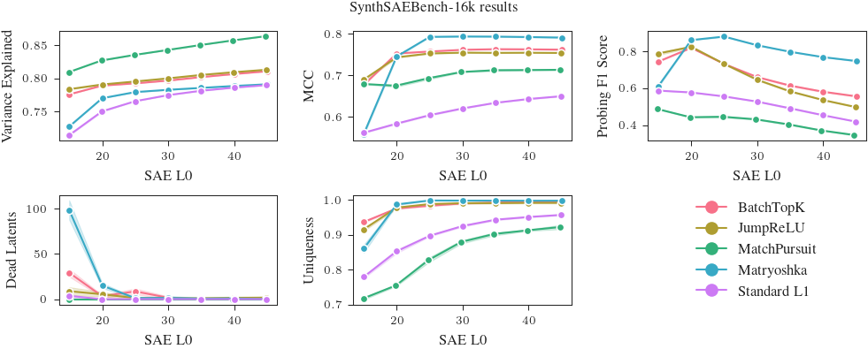

# SynthSAEBench

SynthSAEBench is a benchmark for developing and comparing SAE architectures on synthetic data with known ground-truth features. It consists of **SynthSAEBench-16k**, a standardized synthetic model with 16,384 ground-truth features, and the tools used to build it, which you can also use to create your own custom synthetic models.

When you train an SAE on an LLM, you don't know what the "true" features are, so you have to evaluate with proxies — reconstruction loss, downstream probes, auto-interp. These proxies are noisy enough that it's hard to tell whether a new SAE architecture is actually better, or just different. SynthSAEBench replaces those proxies with direct measurement: because the features are known by construction, you can ask whether the SAE recovered them.

SynthSAEBench is **not** a replacement for LLM-based benchmarks like [SAEBench](https://github.com/adamkarvonen/SAEBench). It's the complementary test: does this architecture actually recover sparse linear features under conditions we control? If it can't do that, there's little reason to expect it to work on a real model.

For a hands-on walkthrough, see the [tutorial notebook](https://github.com/decoderesearch/SAELens/blob/main/tutorials/synth_sae_bench.ipynb)
[](https://githubtocolab.com/decoderesearch/SAELens/blob/main/tutorials/synth_sae_bench.ipynb). For the full API reference, see [Synthetic Data](synthetic_data.md). For the experiments behind the benchmark, see the [SynthSAEBench paper](https://arxiv.org/abs/2602.14687).

## SynthSAEBench-16k

SynthSAEBench-16k is the standardized benchmark model — a pretrained `SyntheticModel` on HuggingFace with a fixed configuration, so results between different SAE architectures are directly comparable.

```python
from sae_lens.synthetic import SyntheticModel

model = SyntheticModel.from_pretrained(
    "decoderesearch/synth-sae-bench-16k-v1", device="cuda"
)
```

**Configuration:**

| Parameter | Value |
|-----------|-------|
| Ground-truth features | 16,384 |
| Hidden dimension | 768 |
| Firing distribution | Zipfian (exponent=0.5, p_max=0.4, p_min=5e-4) |
| Average L0 | ~34 active features per sample |
| Hierarchy | 128 root nodes, branching factor 4, max depth 3 |
| Mutual exclusion | All hierarchical children are mutually exclusive |
| Correlations | Low-rank (rank=25, scale=0.1) |
| Orthogonalization | 100 steps, lr=3e-4 |
| Mean magnitudes | Linear from 5.0 (frequent) to 4.0 (rare) |
| Std magnitudes | Folded normal (mean=0.5, std=0.5) |

The exact code used to build this model is available at [create_synth_bench_16k_model.py](https://github.com/decoderesearch/synth-sae-bench-experiments/blob/main/experiments/create_synth_bench_16k_model.py), so you can regenerate it (or tweak it) yourself. See [Creating Custom Benchmark Models](#creating-custom-benchmark-models) below for a walkthrough of the configuration options.

## Quickstart: Training an SAE on SynthSAEBench-16k

We recommend training SAEs with **width 4096** on SynthSAEBench-16k, as in reality we expect most SAEs to be trained at a narrower width than the underlying number of "true features" of an LLM. For our benchmarking, we use 200M samples with LR of 3e-4, and batch size of 1024. An example BatchTopK SAE training run matching these recommended settings is shown below:

```python
from sae_lens.synthetic import SyntheticSAERunner, SyntheticSAERunnerConfig
from sae_lens import BatchTopKTrainingSAEConfig, LoggingConfig

runner_cfg = SyntheticSAERunnerConfig(
    # Load the pretrained benchmark model
    synthetic_model="decoderesearch/synth-sae-bench-16k-v1",

    # Configure the SAE
    sae=BatchTopKTrainingSAEConfig(
        d_in=768,
        d_sae=4096,
        k=25,
    ),

    # Training parameters
    training_samples=200_000_000,
    batch_size=1024,
    lr=3e-4,
    device="cuda",

    # Output path
    output_path="output",

    # Evaluation
    eval_frequency=1000,  # Evaluate metrics every N steps
    eval_samples=500_000,

    # Performance (recommended for modern GPUs)
    autocast_sae=True,
    autocast_data=True,

    # Optional: Logging to Weights & Biases
    logger=LoggingConfig(
        log_to_wandb=True,
        wandb_project="my_project",
        wandb_entity="my_team",  # Optional
        run_name="my-run",       # Auto-generated if not set
        wandb_log_frequency=100,  # Log metrics every N training steps
    ),
)

runner = SyntheticSAERunner(runner_cfg)
result = runner.run()

# Evaluate with ground-truth metrics
print(f"MCC: {result.final_eval.mcc:.3f}")
print(f"Explained variance: {result.final_eval.explained_variance:.3f}")
print(f"Uniqueness: {result.final_eval.uniqueness:.3f}")
print(f"F1: {result.final_eval.classification.f1_score:.3f}")
print(f"Precision: {result.final_eval.classification.precision:.3f}")
print(f"Recall: {result.final_eval.classification.recall:.3f}")
print(f"L0: {result.final_eval.sae_l0:.1f}")
print(f"Dead latents: {result.final_eval.dead_latents}")
```

## Evaluation Metrics

All metrics are computed by [eval_sae_on_synthetic_data][sae_lens.synthetic.eval_sae_on_synthetic_data], which leverages ground-truth feature vectors and activations.

### Explained Variance (R²)

Fraction of input variance explained by the SAE reconstruction. Measures reconstruction quality independently of feature recovery. A value of 1.0 means perfect reconstruction.

### MCC (Mean Correlation Coefficient)

Uses the Hungarian algorithm to find the optimal one-to-one matching between SAE decoder columns and ground-truth feature vectors, then computes the mean absolute cosine similarity. Range [0, 1] where 1 = perfect recovery of all features. See the paper [Position: Mechanistic Interpretability Should Prioritize Feature Consistency in SAEs](https://arxiv.org/abs/2505.20254) for more details.

### Feature Uniqueness

Fraction of SAE latents that track unique ground-truth features. If multiple latents map to the same ground-truth feature, uniqueness decreases. A value of 1.0 means every active latent corresponds to a different ground-truth feature.

### Classification Metrics (Precision, Recall, F1)

Each SAE latent is treated as a binary classifier for its best-matching ground-truth feature:

- **Precision**: Of the samples where the latent fires, what fraction have the ground-truth feature active? High precision means few false positives.
- **Recall**: Of the samples where the ground-truth feature is active, what fraction does the latent fire for? High recall means few false negatives.
- **F1 Score**: Harmonic mean of precision and recall. Provides a single measure of per-latent detection quality.

### L0 and Dead Latents

- **L0**: Average number of active SAE latents per sample. Compare to the model's true L0 (~34 for SynthSAEBench-16k, or ~25 if we just consider the top 4096 highest-frequency features matching recommended SAE width).
- **Dead latents**: Number of SAE latents that never activate. High values indicate wasted capacity.

### Shrinkage

Ratio of SAE output norm to input norm. Values below 1.0 indicate the SAE is systematically shrinking reconstructions, which is a known issue with L1-penalized SAEs.


## Creating Custom Benchmark Models

You can create custom synthetic models for ablation studies or your own specialized benchmarks. Below is the code to create the synthetic model from scratch. You can customize any part of the configuration to create your own variants.


```python
from sae_lens.synthetic import (
    SyntheticModel,
    SyntheticModelConfig,
    ZipfianFiringProbabilityConfig,
    HierarchyConfig,
    OrthogonalizationConfig,
    LowRankCorrelationConfig,
    LinearMagnitudeConfig,
    FoldedNormalMagnitudeConfig,
)

cfg = SyntheticModelConfig(
    num_features=16_384,
    hidden_dim=768,
    firing_probability=ZipfianFiringProbabilityConfig(
        exponent=0.5,
        max_prob=0.4,
        min_prob=5e-4,
    ),
    hierarchy=HierarchyConfig(
        total_root_nodes=128,
        branching_factor=4,
        max_depth=3,
        mutually_exclusive_portion=1.0,
        mutually_exclusive_min_depth=0,
        compensate_probabilities=True,
        scale_children_by_parent=True,
    ),
    orthogonalization=OrthogonalizationConfig(num_steps=100, lr=3e-4),
    correlation=LowRankCorrelationConfig(rank=25, correlation_scale=0.1),
    mean_firing_magnitudes=LinearMagnitudeConfig(start=5.0, end=4.0),
    std_firing_magnitudes=FoldedNormalMagnitudeConfig(mean=0.5, std=0.5),
    bias=0.5,
    seed=42,
)
model = SyntheticModel(cfg, device="cuda")
```

You can also pass a `SyntheticModelConfig` directly as the `synthetic_model` parameter to `SyntheticSAERunnerConfig` to train an SAE on a custom model. For instance, below we explore the effect of varying the level of superposition on the SAE performance by training an SAE on a model with a different number of hidden dimensions.

```python
from sae_lens.synthetic import (
    SyntheticModel,
    SyntheticModelConfig,
    SyntheticSAERunner,
    SyntheticSAERunnerConfig,
    ZipfianFiringProbabilityConfig,
    HierarchyConfig,
    OrthogonalizationConfig,
    LowRankCorrelationConfig,
    LinearMagnitudeConfig,
    FoldedNormalMagnitudeConfig,
)
from sae_lens import BatchTopKTrainingSAEConfig

# Example: vary the level of superposition
for hidden_dim in [256, 512, 768, 1024, 1536]:
    cfg = SyntheticModelConfig(
        num_features=16_384,
        hidden_dim=hidden_dim,
        firing_probability=ZipfianFiringProbabilityConfig(
            exponent=0.5,
            max_prob=0.4,
            min_prob=5e-4,
        ),
        hierarchy=HierarchyConfig(
            total_root_nodes=128,
            branching_factor=4,
            max_depth=3,
            mutually_exclusive_portion=1.0,
            mutually_exclusive_min_depth=0,
            compensate_probabilities=True,
            scale_children_by_parent=True,
        ),
        orthogonalization=OrthogonalizationConfig(num_steps=100, lr=3e-4),
        correlation=LowRankCorrelationConfig(rank=25, correlation_scale=0.1),
        mean_firing_magnitudes=LinearMagnitudeConfig(start=5.0, end=4.0),
        std_firing_magnitudes=FoldedNormalMagnitudeConfig(mean=0.5, std=0.5),
        bias=0.5,
        seed=42,
    )
    
    runner_cfg = SyntheticSAERunnerConfig(
        synthetic_model=cfg,
        sae=BatchTopKTrainingSAEConfig(
            d_in=hidden_dim,
            d_sae=4096,
            k=25,
        ),
        training_samples=200_000_000,
        batch_size=1024,
        lr=3e-4,
        # ... other parameters skipped for brevity ...
    )
    results = SyntheticSAERunner(runner_cfg).run()
```

For the full API reference on all configuration options, see [Synthetic Data](synthetic_data.md).

## Benchmark Results

We have trained and evaluated a series of SAEs on SynthSAEBench-16k. The code for these experiments is at [https://github.com/decoderesearch/synth-sae-bench-experiments](https://github.com/decoderesearch/synth-sae-bench-experiments). Full results and SAEs are available at [https://huggingface.co/decoderesearch/synth-sae-bench-16k-v1-saes](https://huggingface.co/decoderesearch/synth-sae-bench-16k-v1-saes).



### Raw results for SynthSAEBench-16k at selected L0s

We report the mean and standard deviation of the F1 score, MCC, uniqueness, and explained variance for each SAE architecture at L0=25 and L0=20 from the plots above. The true L0 of the first 4096 latents of SynthSAEBench-16k is ~25, but we find that some architectures perform better at L0=20 (due to feature absorption). In reality, the user of an SAE can pick the L0 where their SAE performs best, so we report results for both L0=25 and L0=20.

*If you have an architecture that you would like to add to this list, please open an issue or pull request!*

**L0 = 25**

| SAE          | F1 score        | MCC             | Uniqueness      | Var. explained  |
|--------------|-----------------|-----------------|-----------------|-----------------|
| **BatchTopK**    | 0.7316 <span class="stdev">± 0.0010</span> | 0.7574 <span class="stdev">± 0.0003</span> | 0.9837 <span class="stdev">± 0.0015</span> | 0.7923 <span class="stdev">± 0.0003</span> |
| **Matryoshka**   | **0.8793** <span class="stdev">± 0.0021</span> | **0.7927** <span class="stdev">± 0.0006</span> | **0.9987** <span class="stdev">± 0.0005</span> | 0.7792 <span class="stdev">± 0.0004</span> |
| **MatchPursuit** | 0.4464 <span class="stdev">± 0.0044</span> | 0.6930 <span class="stdev">± 0.0030</span> | 0.8281 <span class="stdev">± 0.0069</span> | **0.8351** <span class="stdev">± 0.0003</span> |
| **Standard L1**  | 0.5562 <span class="stdev">± 0.0020</span> | 0.6039 <span class="stdev">± 0.0012</span> | 0.8976 <span class="stdev">± 0.0021</span> | 0.7654 <span class="stdev">± 0.0001</span> |
| **JumpReLU**     | 0.7317 <span class="stdev">± 0.0034</span> | 0.7527 <span class="stdev">± 0.0009</span> | 0.9885 <span class="stdev">± 0.0010</span> | 0.7951 <span class="stdev">± 0.0004</span> |

**L0 = 20**

| SAE          | F1 score        | MCC             | Uniqueness      | Var. explained  |
|--------------|-----------------|-----------------|-----------------|-----------------|
| **BatchTopK**    | 0.8183 <span class="stdev">± 0.0011</span> | **0.7526** <span class="stdev">± 0.0007</span> | 0.9760 <span class="stdev">± 0.0028</span> | 0.7889 <span class="stdev">± 0.0002</span> |
| **Matryoshka**   | **0.8601** <span class="stdev">± 0.0016</span> | 0.7455 <span class="stdev">± 0.0021</span> | **0.9874** <span class="stdev">± 0.0020</span> | 0.7699 <span class="stdev">± 0.0002</span> |
| **MatchPursuit** | 0.4439 <span class="stdev">± 0.0024</span> | 0.6748 <span class="stdev">± 0.0028</span> | 0.7552 <span class="stdev">± 0.0026</span> | **0.8267** <span class="stdev">± 0.0003</span> |
| **Standard L1**  | 0.5777 <span class="stdev">± 0.0012</span> | 0.5834 <span class="stdev">± 0.0015</span> | 0.8528 <span class="stdev">± 0.0055</span> | 0.7501 <span class="stdev">± 0.0009</span> |
| **JumpReLU**     | 0.8241 <span class="stdev">± 0.0041</span> | 0.7434 <span class="stdev">± 0.0015</span> | 0.9781 <span class="stdev">± 0.0029</span> | 0.7906 <span class="stdev">± 0.0005</span> |


## Citation

If you use SynthSAEBench in your research, please cite:

```
@article{synthsaebench2026,
  title={SynthSAEBench: Evaluating Sparse Autoencoders on Scalable Realistic Synthetic Data},
  author={David Chanin and Adrià Garriga-Alonso},
  journal={arXiv preprint arXiv:2602.14687},
  year={2026}
}
```
